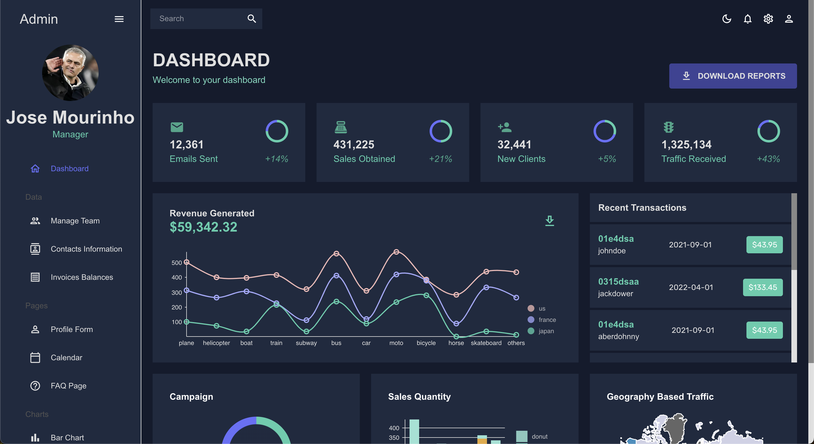

<h1>Simple React Admin Dashboard</h1>

  
  
  

<h2>Overview</h2>

This project is a sleek, responsive admin dashboard built using React and Material UI, designed to offer a simple yet powerful interface for managing applications. It incorporates FullCalendar, Nivo Charts, Context API for state management, customizable theming, and DataGrid for advanced data handling, providing a comprehensive toolkit for creating dynamic admin interfaces.

<h2>Preview</h2>

<h3>Features</h3>
<ul>
  <li><strong>React & Material UI</strong>: Leveraging React for dynamic UI updates and Material UI for modern, responsive design.</li>
  <li><strong>FullCalendar</strong>: Integrated for managing events and tasks with ease.</li>
  <li><strong>Nivo Charts</strong>: Utilized for beautiful, interactive data visualizations.</li>
  <li><strong>Context API</strong>: Employed for efficient state management across components.</li>
  <li><strong>Theming</strong>: Supports theme customization to align with your branding.</li>
  <li><strong>DataGrid</strong>: Advanced grid for displaying and manipulating large data sets.</li>
</ul>

<h2>Quick Start</h2>
<h3>Prerequisites</h3>
<ul>
  <li>Node.js (latest stable version)</li>
  <li>npm or yarn</li>
</ul>

<h3>Installation</h3>
<pre>
<code># Clone the repository
git clone https://github.com/your-repository/react-admin-dashboard.git

# Navigate to the project directory
cd react-admin-dashboard

# Install dependencies
npm install
</code>
</pre>

<h3>Run the Dashboard</h3>
<pre>
<code># Start the development server
npm start

# Open http://localhost:3000 in your browser
</code>
</pre>

<h2>Contributing</h2>

Your contributions are welcome! Please feel free to submit issues, pull requests, or feature suggestions to enhance the project.

<h2>License</h2>

This project is licensed under the MIT License - see the <a href="LICENSE">LICENSE</a> file for details.

